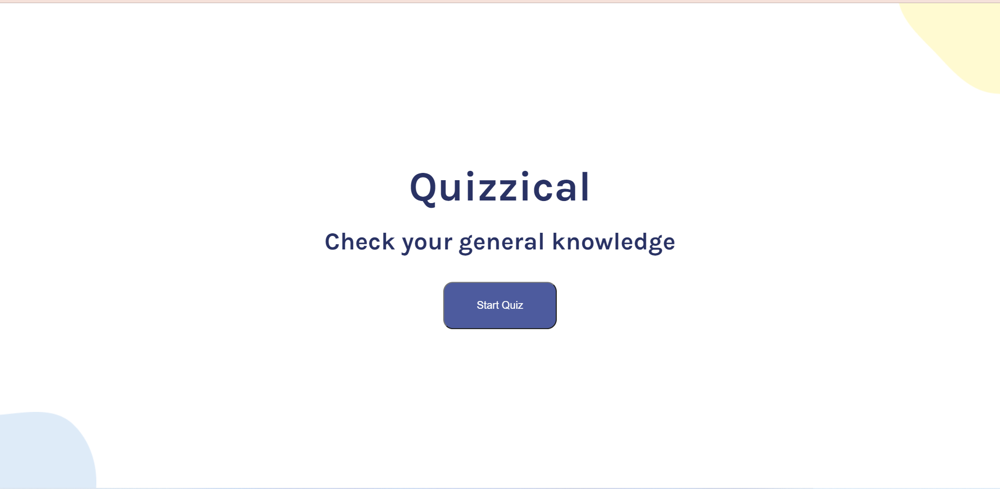
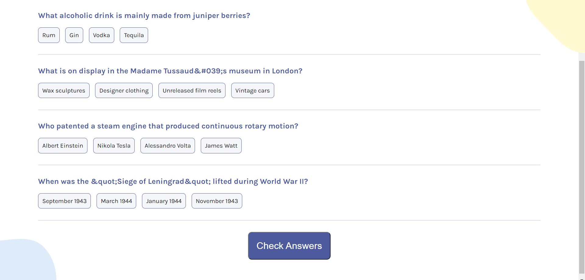
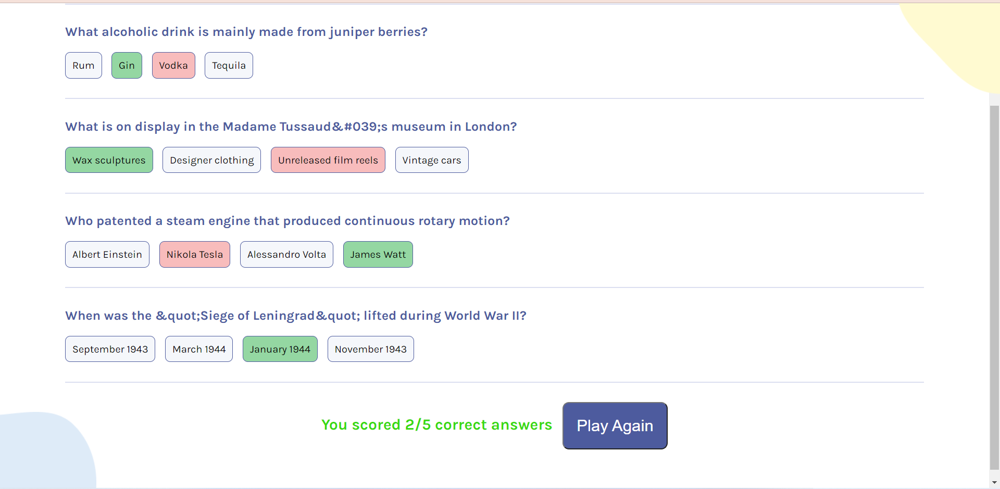

# Quizzical
Quizzical is a general knowlwdge assesment app. Users can check their general knowledge by answering multiple choice questions randomly fetched from an API.

Deployed Link: https://quizzical01.netlify.app

## Description
This app has two screens (start, and questions). Each time 5 questions are pulled from the Open Trivia DataBase API. The selections made by users are checked for correctness when the "Check Answer" button is clicked.
User can restart with new questions by clicking the "Play Again" button.

## My Contribution and Learnings
I used the Create-React-App environment to build this quiz app. I wrote the entire JavaScript, HTML, and CSS code for this app.
While completing this project I learned about making effective use of custom components, and pulling data from an API, and useState, and useEffect hooks.

## Technology and Tools Used
JavaScript, Create-React-App environment, HTML, CSS, Figma, Netlify(Deployment)

